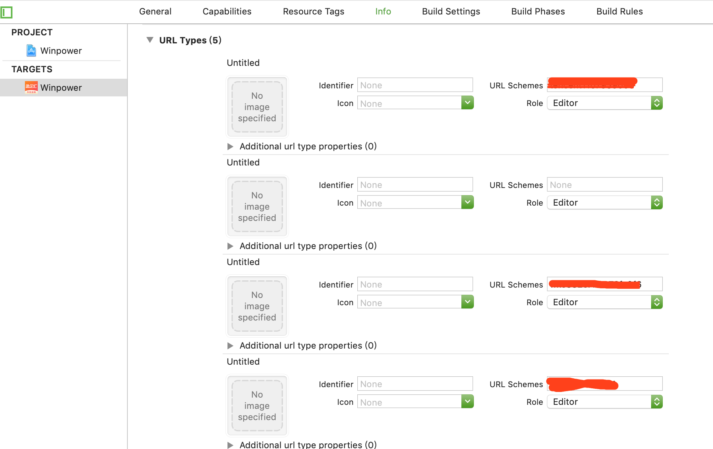
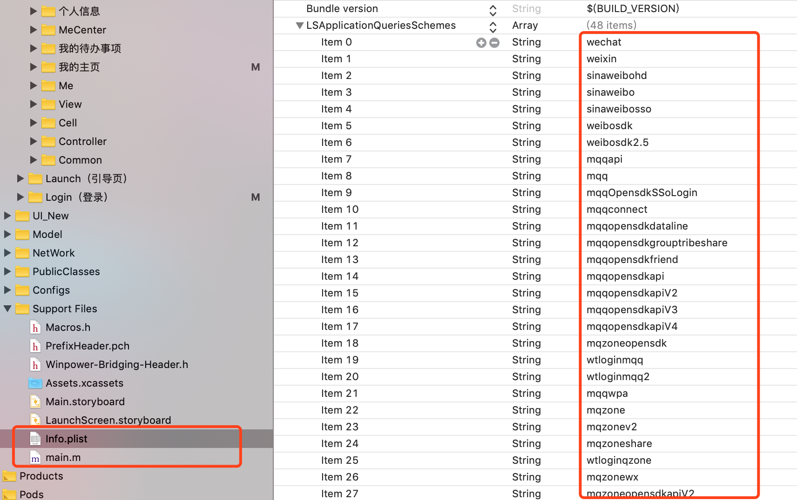

# KJShareDemo


----------------------------------------
### 框架整体介绍
* [作者信息](#作者信息)
* [作者其他库](#作者其他库)
* [使用方法](#使用方法)

#### <a id="作者信息"></a>作者信息
> Github地址：https://github.com/yangKJ  
> 简书地址：https://www.jianshu.com/u/c84c00476ab6  
> 博客地址：https://blog.csdn.net/qq_34534179  

#### <a id="作者其他库"></a>作者其他Pod库
```
播放器 - KJPlayer是一款视频播放器，AVPlayer的封装，继承UIView
pod 'KJPlayer'  # 播放器功能区
pod 'KJPlayer/KJPlayerView'  # 自带展示界面

实用又方便的Category和一些自定义控件
pod 'KJEmitterView'
pod 'KJEmitterView/Function'#
pod 'KJEmitterView/Control' # 自定义控件

轮播图 - 支持缩放 多种pagecontrol 支持继承自定义样式 自带网络加载和缓存
pod 'KJBannerView'  # 轮播图，网络图片加载

菜单控件 - 下拉控件 选择控件
pod 'KJMenuView' # 菜单控件

加载Loading - 多种样式供选择
pod 'KJLoadingAnimation' # 加载控件

```

##### Issue
如果您在使用中有好的需求及建议，或者遇到什么bug，欢迎随时issue，我会及时的回复，有空也会不断优化更新这些库

#### <a id="使用方法"></a>使用方法
```
添加类库
1.在other linker flags增加-ObjC,-all_load 选项，并添加ImageIO.framework（实现新浪微博必须完成的步骤） 
```

#### 其它类库，动态库后缀可能不同
```
Security.framework
libiconv.dylib
SystemConfiguration.framework
CoreGraphics.Framework
libsqlite3.dylib
CoreTelephony.framework
libstdc++.dylib
libz.dylib
```

#### 在info.plist添加白名单  https://developer.umeng.com/sdk/ios
```应用跳转
 URL Schemes
 info.plist -> URL Types
 微信：wx + 微信appSecret
 腾讯：tencent + 腾讯appKey,  QQ + 腾讯appKey的十六进制(不够8位，前面补0)
 新浪：wb + 新浪appKey,  sina. + 新浪appSecret
```
<p align="left">
  
    
</p>

#### Appdelegate 添加代码
```
 #pragma mark - 友盟相关
 // 支持所有iOS系统
 - (BOOL)application:(UIApplication *)application openURL:(NSURL *)url sourceApplication:(NSString *)sourceApplication annotation:(id)annotation{
 BOOL result = [[KJShareView kj_UMSocialManger] handleOpenURL:url];
 if (!result) {
 // 其他如支付等SDK的回调
 }
 return result;
 }
 - (BOOL)application:(UIApplication *)application handleOpenURL:(NSURL *)url{
 BOOL result = [[KJShareView kj_UMSocialManger] handleOpenURL:url];
 if (!result) {
 // 其他如支付等SDK的回调
 }
 return result;
 }
```

#### 使用代码事例
```
/// 第一种使用方法
//创建分享消息对象
UMSocialMessageObject *messageObject = [UMSocialMessageObject messageObject];
//创建网页内容对象
UMShareWebpageObject *shareObject = [UMShareWebpageObject shareObjectWithTitle:@"标题" descr:@"小标题" thumImage:[UIImage imageNamed:@"icon"]];
//设置网页地址
shareObject.webpageUrl = @"www.baidu.com";
//分享消息对象设置分享内容对象
messageObject.shareObject = shareObject;
KJShareView *shareView = [KJShareView createShareView:nil];
shareView.messageObject = messageObject;
shareView.kj_completeBlock = ^(id data, NSError *error) {
NSString *msg = error == nil ? @"分享成功" : @"分享失败";
};

/// 第二种使用方法
KJShareView *shareView2 = [KJShareView createShareView:nil];
shareView2.title = @"标题";
shareView2.descr = @"小标题";
shareView2.webpageUrl = @"www.baidu.com";
/// 设置分享平台
shareView2.platformTemps = @[@(KJShareViewPlatformTypeWeChatSession),@(KJShareViewPlatformTypeWechatTimeLine)];
[shareView2 shareWithContentType:(KJShareViewContentTypeWebpage) CompleteBlock:^(id data, NSError *error) {

}];
```
