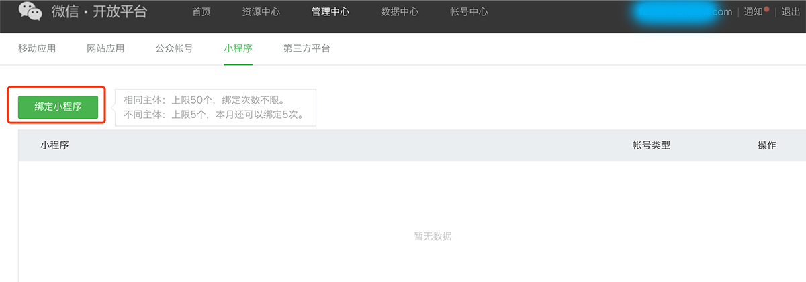

# KJShareDemo

#### <a id="使用方法"></a>使用方法
```
添加类库
1.在other linker flags增加-ObjC,-all_load 选项，并添加ImageIO.framework（实现新浪微博必须完成的步骤） 
```

#### 其它类库，动态库后缀可能不同
```
Security.framework
libiconv.dylib
SystemConfiguration.framework
CoreGraphics.Framework
libsqlite3.dylib
CoreTelephony.framework
libstdc++.dylib
libz.dylib
```

#### 在info.plist添加白名单  https://developer.umeng.com/sdk/ios
```应用跳转
URL Schemes
info.plist -> URL Types
微信：wx + 微信appSecret
腾讯：tencent + 腾讯appKey,  QQ + 腾讯appKey的十六进制(不够8位，前面补0)
新浪：wb + 新浪appKey,  sina. + 新浪appSecret
```
<p align="left">
  
    
</p>

#### Appdelegate 添加代码
```
#pragma mark - 友盟相关
// 支持所有iOS系统
- (BOOL)application:(UIApplication *)application openURL:(NSURL *)url sourceApplication:(NSString *)sourceApplication annotation:(id)annotation{
    BOOL result = [[KJShareView kj_UMSocialManger] handleOpenURL:url];
    if (!result) {
        // 其他如支付等SDK的回调
    }
    return result;
}
- (BOOL)application:(UIApplication *)application handleOpenURL:(NSURL *)url{
    BOOL result = [[KJShareView kj_UMSocialManger] handleOpenURL:url];
    if (!result) {
        // 其他如支付等SDK的回调
    }
    return result;
}
```

#### 使用代码事例
```
/// 第一种使用方法
//创建分享消息对象
UMSocialMessageObject *messageObject = [UMSocialMessageObject messageObject];
//创建网页内容对象
UMShareWebpageObject *shareObject = [UMShareWebpageObject shareObjectWithTitle:@"标题" descr:@"小标题" thumImage:[UIImage imageNamed:@"icon"]];
//设置网页地址
shareObject.webpageUrl = @"www.baidu.com";
//分享消息对象设置分享内容对象
messageObject.shareObject = shareObject;
KJShareView *shareView = [KJShareView createShareView:nil];
shareView.messageObject = messageObject;
shareView.kj_completeBlock = ^(id data, NSError *error) {
    NSString *msg = error == nil ? @"分享成功" : @"分享失败";
};

/// 第二种使用方法
KJShareView *shareView = [KJShareView createShareView:nil];
/// 设置分享平台
shareView.platformTemps = @[@(KJShareViewPlatformTypeWeChatSession),@(KJShareViewPlatformTypeWechatTimeLine)];
shareView.title = @"标题";
shareView.descr = @"小标题";
shareView.hdImage = shareView.thumbImage = @"图片";
shareView.hdWebpageUrl = @"www.baidu.com";
shareView.correlationID = @"123";
shareView.pathType = KJShareViewSharePathTypeZQRZDetail;
[shareView shareWithContentType:(KJShareViewContentTypeMiniProgram) CompleteBlock:^(id data, NSError *error) {
    NSString *msg = error == nil ? @"分享成功" : @"分享失败";
}];
```
#### 绑定小程序
<p align="left">
  
    
</p>
